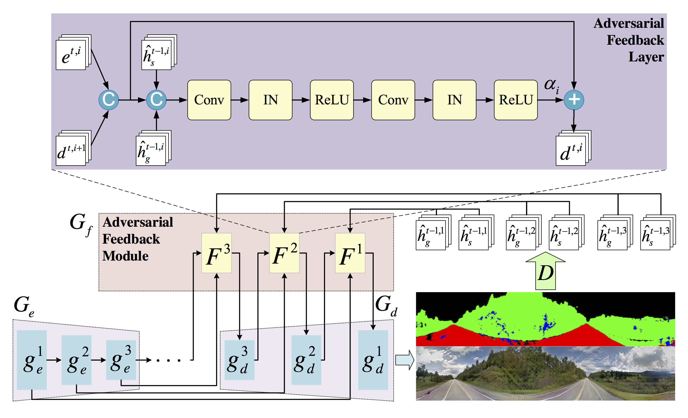

[](https://github.com/sswuai/PanoGAN/blob/master/LICENSE.md)


[]((https://github.com/sswuai/PanoGAN/graphs/commit-activity))


## Contents
  - [PanoGAN](#PanoGAN)
  - [Installation](#Installation)
  - [Dataset Preparation](#Dataset-Preparation)
  - [Generating Images Using Pretrained Model](#Generating-Images-Using-Pretrained-Model)
  - [Train and Test New Models](#Train-and-Test-New-Models)
  - [Evaluation](#Evaluation)
  - [Acknowledgments](#Acknowledgments)
  - [Related Projects](#Related-Projects)
  - [Citation](#Citation)
  - [Contributions](#Contributions)

## PanoGAN

**[PanoGAN for Cross-View Panorama Image Synthesis](https://arxiv.org/abs/2008.04381)**  
[Songsong Wu](https://www.researchgate.net/profile/Songsong_Wu), [Hao Tang](http://disi.unitn.it/~hao.tang/), [Xiaoyuan Jing](https://scholar.google.com/citations?user=2IInQAgAAAAJ&hl=en), [Haifeng Zhao](https://scholar.google.com/citations?hl=en&user=EOMB0c4AAAAJ&view_op=list_works&sortby=pubdate), [Jianjun Qian](https://scholar.google.com/citations?hl=en&user=oLLDUM0AAAAJ), [Nicu Sebe](https://scholar.google.com/citations?user=stFCYOAAAAAJ&hl=en), and [Yan Yan](https://scholar.google.com/citations?user=zhi-j1wAAAAJ&hl=en).<br>
Submited to IEEE Transactions on Multimedia. <br>

### Framework


### Generator


### Discriminator


### Comparison Results on the CVUSA Dataset


### Comparison Results on the OP Dataset


### [License](./LICENSE.md)

All rights reserved.
Licensed under the [CC BY-NC-SA 4.0](https://creativecommons.org/licenses/by-nc-sa/4.0/legalcode) (**Attribution-NonCommercial-ShareAlike 4.0 International**)

The code is released for academic research use only. For commercial use, please contact [sswuai@gmail.com](sswuai@gmail.com).

## Installation

Clone this repo.
```bash
git clone https://github.com/sswuai/PanoGAN.git
cd PanoGAN/
```

This code requires PyTorch 1.0.0 and python 3.6.9+. Please install the following dependencies:
* pytorch 1.0.0
* torchvision
* numpy
* scipy
* scikit-image
* pillow
* dominate

To reproduce the results reported in the paper, you need to run experiments with at least 1 NVIDIA 2080Ti GPU.

## Dataset Preparation

Please follow [SelectionGAN](https://github.com/Ha0Tang/SelectionGAN/tree/master/person_transfer#data-preperation) to directly download both Market-1501 and DeepFashion datasets.

## Generating Images Using Pretrained Model
### PanoGAN trained with 35,548 aerial-panorama image pairs on CVUSA dataset
```bash
cd scripts/
sh download_bigraphgan_model.sh market
cd ..
cd market_1501/
```
Then,
1. Change several parameters in `test_market_pretrained.sh`.
2. Run `sh test_market_pretrained.sh` for testing.

### PanoGAN tranined on OP dataset
```bash
cd scripts/
sh download_bigraphgan_model.sh deepfashion
cd ..
cd deepfashion/
```
Then,
1. Change several parameters in `test_deepfashion_pretrained.sh`.
2. Run `sh test_deepfashion_pretrained.sh` for testing.

## Train and Test New Models
### CVUSA dataset
1. Go to the [scripts](https://github.com/sswuai/PanoGAN/tree/master/scripts) folder. 
2. Change several parameters in `train_panogan_cvusa.sh` (or `train_panogan_cvusa_partial.sh`).
3. Run `sh train_panogan_cvusa.sh` (or `sh train_panogan_cvusa_partial.sh`)  for training.
4. Change several parameters in `test_panogan_cvusa.sh`.
5. Run `sh test_panogan_cvusa.sh` for testing.

### OP dataset
1. Go to the [scripts](https://github.com/sswuai/PanoGAN/tree/master/scripts) folder. 
2. Change several parameters in `train_panogan_op.sh`.
3. Run `sh train_panogan_op.sh` for training.
4. Change several parameters in `test_panogan_op.sh`.
5. Run `sh test_panogan_op.sh` for testing.

## Evaluation
We adopt Prediction Accuracy, Inception Score, KL Score, SSIM, PSNR, and SD for evaluation of all the involved methods. Please refer to [Evaluation](https://github.com/sswuai/PanoGAN/tree/master/Evaluation) for more details.
 
## Acknowledgments
This source code is inspired by both [Pix2Pix](https://github.com/phillipi/pix2pix.git) and [SelectionGAN](https://github.com/Ha0Tang/SelectionGAN). 

## Related Projects
**[SelectionGAN](https://github.com/Ha0Tang/SelectionGAN) | [Guided-I2I-Translation-Papers](https://github.com/Ha0Tang/Guided-I2I-Translation-Papers)**

## Citation
If you use this code for your research, please cite our papers.

```
@inproceedings{tang2019multi,
  title={Multi-channel attention selection gan with cascaded semantic guidance for cross-view image translation},
  author={Tang, Hao and Xu, Dan and Sebe, Nicu and Wang, Yanzhi and Corso, Jason J and Yan, Yan},
  booktitle={CVPR},
  year={2019}
}

```

## Contributions
If you have any questions/comments/bug reports, feel free to open a github issue or pull a request or e-mail to the author Songsong Wu ([sswuai@gmail.com](sswuai@gmail.com)).
