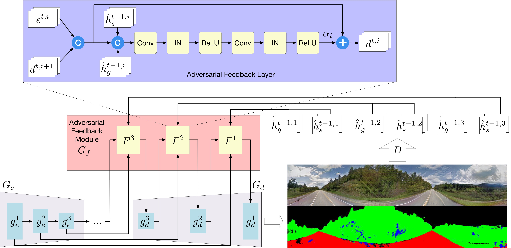
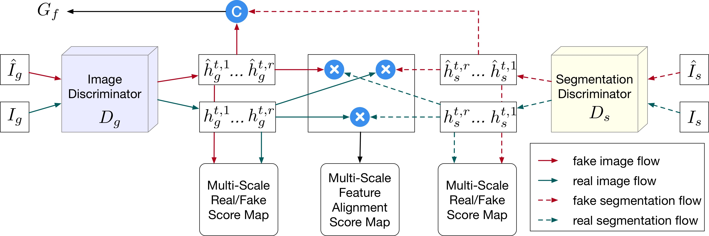
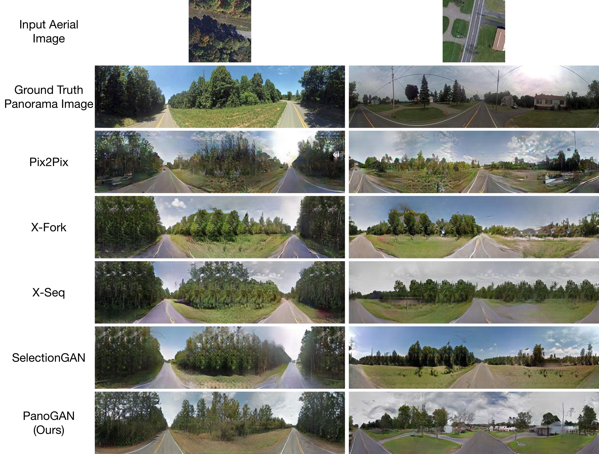
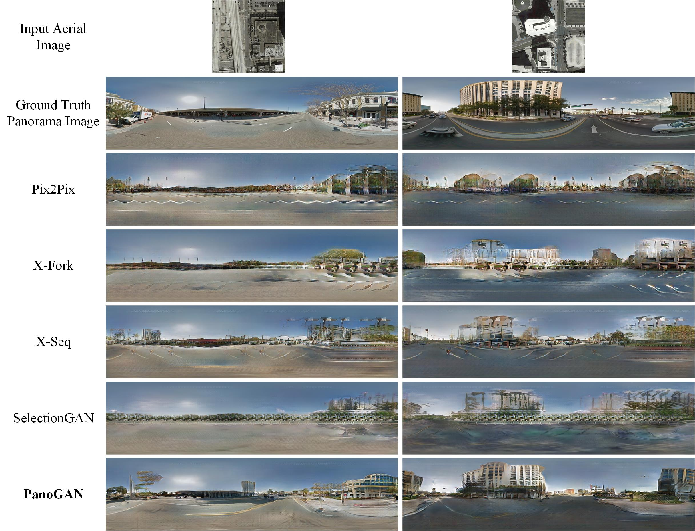

[](https://github.com/sswuai/PanoGAN/blob/master/LICENSE.md)


[]((https://github.com/sswuai/PanoGAN/graphs/commit-activity))


## Contents
  - [PanoGAN](#PanoGAN)
  - [Installation](#Installation)
  - [Dataset Preparation](#Dataset-Preparation)
  - [Generating Images Using Pretrained Model](#Generating-Images-Using-Pretrained-Model)
  - [Train and Test New Models](#Train-and-Test-New-Models)
  - [Evaluation](#Evaluation)
  - [Acknowledgments](#Acknowledgments)
  - [Related Projects](#Related-Projects)
  - [Contributions](#Contributions)

## PanoGAN

**[Cross-View Panorama Image Synthesis](https://arxiv.org/pdf/2203.11832.pdf)**  
[Songsong Wu](https://www.researchgate.net/profile/Songsong_Wu)\*, [Hao Tang](http://disi.unitn.it/~hao.tang/)\*, [Xiaoyuan Jing](https://scholar.google.com/citations?user=2IInQAgAAAAJ&hl=en), [Haifeng Zhao](https://scholar.google.com/citations?hl=en&user=EOMB0c4AAAAJ&view_op=list_works&sortby=pubdate), [Jianjun Qian](https://scholar.google.com/citations?hl=en&user=oLLDUM0AAAAJ), [Nicu Sebe](https://scholar.google.com/citations?user=stFCYOAAAAAJ&hl=en), and [Yan Yan](https://scholar.google.com/citations?user=zhi-j1wAAAAJ&hl=en).<br>
(* equal contributions) <br>
IEEE Transactions on Multimedia, 2022. <br>

### Framework


<br>

### Generator


<br>

### Discriminator


<br>

### Comparison Results on the CVUSA Dataset


<br>

### Comparison Results on the OP Dataset


<br>

### [License](./LICENSE.md)

All rights reserved.
Licensed under the [CC BY-NC-SA 4.0](https://creativecommons.org/licenses/by-nc-sa/4.0/legalcode) (**Attribution-NonCommercial-ShareAlike 4.0 International**)

The code is released for academic research use only. For commercial use, please contact [sswuai@gmail.com](sswuai@gmail.com).

## Installation

Clone this repo.
```bash
git clone https://github.com/sswuai/PanoGAN.git
cd PanoGAN/
```

This code requires PyTorch 1.0.0 and python 3.6.9+. Please install dependencies by
```
pip install -r requirements.txt (for pip users)
```
or
```
./scripts/conda_deps.sh (for Conda users)
```


To reproduce the results reported in the paper, you need to run experiments with at least 1 NVIDIA 2080Ti GPU.

## Dataset Preparation

Please download the dataset CVUSA from google drive: [Training sample set for ablation study](https://drive.google.com/file/d/1KGAEbWL3q9Fi5axzaf_CROp92KZ_PVjS/view?usp=sharing), [Test sample set](https://drive.google.com/file/d/1_BZ1D5Jw0CFjLlPXRURhRRWJLms_M3Ho/view?usp=sharing).

Please download the dataset OP from google drive: [Training sample set](https://drive.google.com/file/d/1Gf7v27PFV4Gu7I23yuhSiu3pixiIukk4/view?usp=sharing), [Test sample set](https://drive.google.com/file/d/1YZkGOZvcfpn4A9sEwecmzK6p_knOISjA/view?usp=sharing).


## Generating Images Using Pretrained Model
### PanoGAN model tranined on CVUSA dataset with all training samples
1. Download the model trained on CVUSA dataset from [PanoGAN model on CVUSA](https://drive.google.com/file/d/1-ChbRTJ-we8xVkhiPoMza08VZ0Ik0UPm/view?usp=sharing).
2. Unzip the file to checkpoints/
3. Change several parameters in `test_panogan_cvusa.sh`.
4. Run `sh test_panogan_cvusa.sh` for testing.

### PanoGAN model tranined on OP dataset
1. Download the model trained on OP dataset from [PanoGAN model on OP](https://drive.google.com/file/d/13zFb9vYnFUkqvN40g3SpUkUUhooVrXfA/view?usp=sharing).
2. Unzip the file to checkpoints/
3. Change several parameters in `test_panogan_op.sh`.
4. Run `sh test_panogan_op.sh` for testing.

## Train and Test New Models
### CVUSA dataset
1. Go to the [scripts](https://github.com/sswuai/PanoGAN/tree/master/scripts) folder. 
2. Change several parameters in `train_panogan_cvusa.sh` (or `train_panogan_cvusa_ablation_study.sh`).
3. Run `sh train_panogan_cvusa.sh` (or `sh train_panogan_cvusa_ablation_study.sh`)  for training.
4. Change several parameters in `test_panogan_cvusa.sh`.
5. Run `sh test_panogan_cvusa.sh` for testing.

### OP dataset
1. Go to the [scripts](https://github.com/sswuai/PanoGAN/tree/master/scripts) folder. 
2. Change several parameters in `train_panogan_op.sh`.
3. Run `sh train_panogan_op.sh` for training.
4. Change several parameters in `test_panogan_op.sh`.
5. Run `sh test_panogan_op.sh` for testing.

## Evaluation
We adopt Prediction Accuracy, Inception Score, KL Score, SSIM, PSNR, and SD for evaluation of all the involved methods. Please refer to [Evaluation](https://github.com/sswuai/PanoGAN/tree/master/evaluation) for more details.
 
## Acknowledgments
This source code is inspired by both [Pix2Pix](https://github.com/phillipi/pix2pix.git) and [SelectionGAN](https://github.com/Ha0Tang/SelectionGAN). 

## Related Projects
**[CrossMLP](https://github.com/Amazingren/CrossMLP) | [SelectionGAN](https://github.com/Ha0Tang/SelectionGAN) | [LGGAN](https://github.com/Ha0Tang/LGGAN) | [DAGAN](https://github.com/Ha0Tang/DAGAN) | [DPGAN](https://github.com/Ha0Tang/DPGAN) | [Guided-I2I-Translation-Papers](https://github.com/Ha0Tang/Guided-I2I-Translation-Papers)**

## Citation
```
@article{wu2022cross,
  title={Cross-View Panorama Image Synthesis},
  author={Wu, Songsong and Tang, Hao and Jing, Xiao-Yuan and Zhao, Haifeng and Qian, Jianjun and Sebe, Nicu and Yan, Yan},
  journal={IEEE Transactions on Multimedia (TMM)},
  year={2022}
}
```

## Contributions
If you have any questions/comments/bug reports, feel free to open a github issue or pull a request or e-mail to the author Songsong Wu ([sswuai@gmail.com](sswuai@gmail.com)).

## Collaborations
I'm always interested in meeting new people and hearing about potential collaborations. If you'd like to work together or get in contact with me, please email bjdxtanghao@gmail.com. Some of our projects are listed [here](https://github.com/Ha0Tang).
